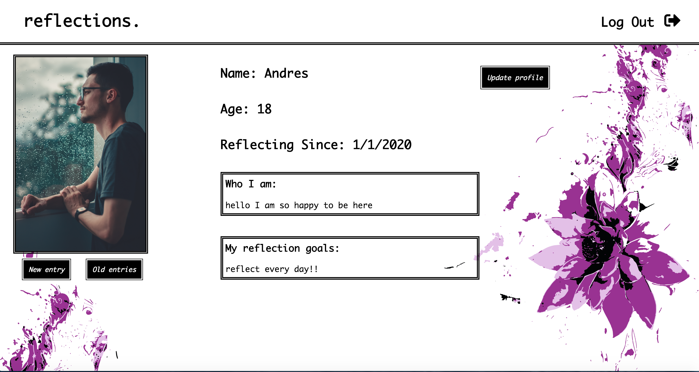
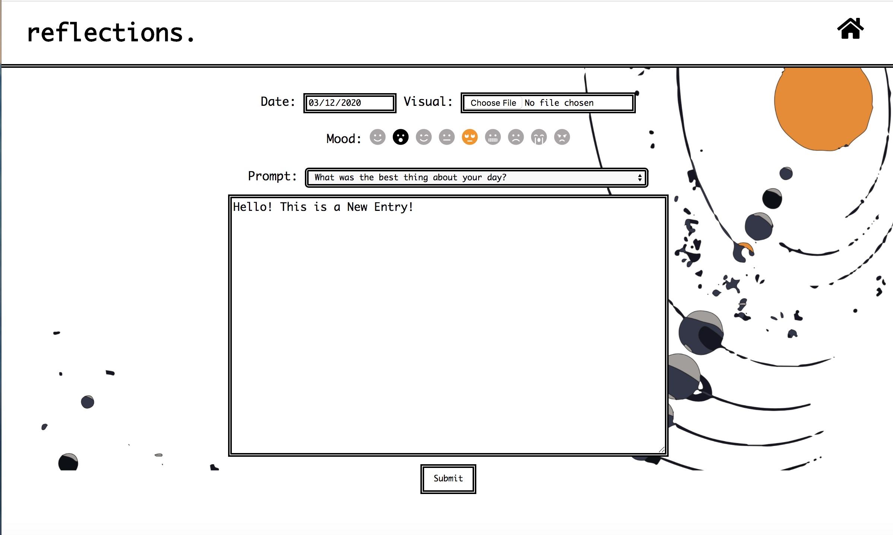
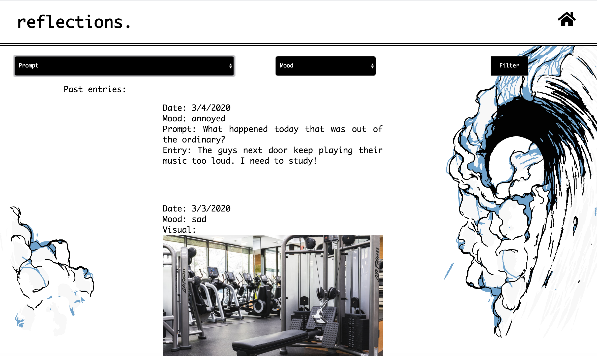

# Reflections-Project-Winter-2020

This quarter we focused on building our app, Reflections, to aid people who are unable to actively and effectively practice self-reflection, even if it is something they wish to do. Many people consider meditation to be a very important pillar for mental health, but lack the discipline or the instruction, and might feel intimidated by looking at a blank sheet of paper. Furthermore, many self-reflection apps are more aimed towards meditation, and less so towards story-telling or journaling. Therefore, our team attempted to build into this niche of people who aim to reflect, but need a more interactive medium to use.

## USER RESEARCH
We approached user research at first to answer whether or not an app with our idea would have a potential audience. We also wanted to know what obstacles people faced in approaching self reflection in order to guide our app to help fix those issues. 

Through interviews, we found that people tended to write in physical journals as opposed to an app, and those who used apps used more meditative apps, such as Calm or Headspace. Those who did not reflect often felt as if they were too busy and/or did not have enough time, or simply never knew what to reflect on. Therefore, we found our app would need to be simple to use and provide a quick interface for reflection, so the act of reflecting wouldn’t take too much time. Our app also had to help with guided reflection, to give users that did not know where to start an idea for how to begin their reflection. 

We also learned that our target audience was skewed towards the younger side. Younger users are more open to the use of technology in reflection, and often do not have a system in place for reflection already. This was especially apparent in our collegiate interviewees, which is understandable considering the constant change that occurs during college. 

## PAPER PROTOTYPING
We then moved on to a paper prototype that was tested on several people our age, as they were isolated as the target audience we are trying to reach. A video of the prototype usage is embedded below, simply click the prototype image. Although simple, our prototype was well received by our users. The layout was easily understandable, and the mood icons were a specific favorite of most users. Some users did note we did not have a way to go to previous pages on our prototype. Therefore, we took away that our design needed to be simple and include mood icons, and a home-type button would be a necessity. 

## HIGH FIDELITY PROTOTYPING
We decided our final prototype would be a journaling app that supported an online journal. We wanted our users to feel like this journal was theirs, so we implemented user profiles to act as a functional homepage and a way to customize their experience. First, the user logs into their account, where they are brought to their homepage.

From the homepage, the user can either opt to customize their account, search their old entries, or create a new entry.
The data collection acts as a new entry page, in which the user can create a new journal entry, and add a mood or visual. Once the user clicks submit, the entry is saved and the user is brought back to their homepage. 

The filter acts as the old entries storage, in which a user can filter their database on mood or prompt to find the entry they are interested in. 

## REFLECTION

Our team managed to build an aesthetically pleasing app with most of the tasks we set out to accomplish. We have a well structured reflection app with two profiles and the ability to look at previous entries and filter them, which is very close to what we thought about doing during our paper prototype. We implemented a lot of the feedback we got during the studio sessions, mostly limited to functionality but also related to aesthetics and presentation. In the future, if we were to continue building upon this app, we think that it would be useful to display in terms of calendar so that it is easier to navigate the past entries, and apply more filters and more tags for the entries. We also believe that it would be useful to let everything be more personalized, such as make a very unique profile or add a rich text editor so that entries can reflect the current state of the user. Also, it would be useful to run more user research and collect information on whether we would want to be able to edit or delete previous entries.

## LINKS

Open the website in Google Chrome by opening the login site at login.html and typing either one of our preset users:

### User 1: Nicole
Username: nicole123
Password: nicole123

### User 2: Andres
Username: andres123
Password: andres123

This should take you to the main page of our website, which is the user profile. It has a picture of the user, a biography and meditation goals. Also at the bottom are two buttons, one to submit a new entry and another one to check previous entries.

Clicking the New Entries button would take you to the page where you submit a new entry and you get the option to tag your entries according to different filters, such as date and mood, and you get to add a file that would most likely be an image. 

Clicking the Previous Entries button takes you to a list of all the previous entries, sorted default by chronological order. It also lets the user filter through previous entries according to the mood and to the prompt that was selected.

