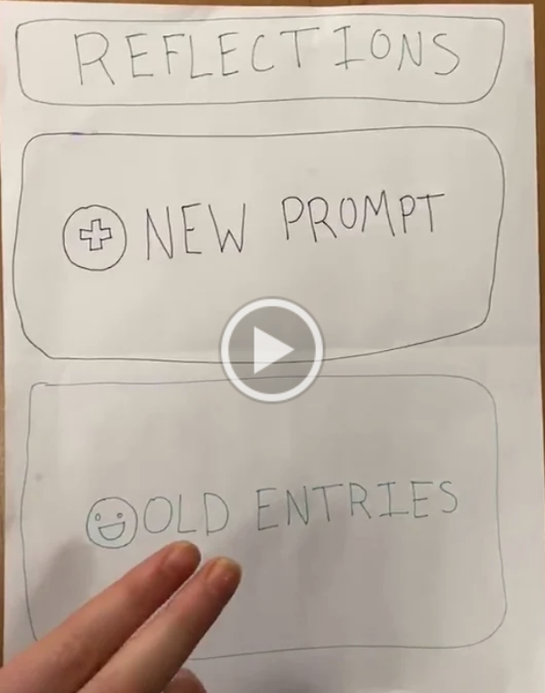

# Reflections-Project-Winter-2020

This quarter we focused on building our app, Reflections, to aid people who are unable to actively and effectively practice self-reflection, even if it is something they wish to do. Many people consider meditation to be a very important pillar for mental health, but lack the discipline or the instruction, and might feel intimidated by looking at a blank sheet of paper. Furthermore, many self-reflection apps are more aimed towards meditation, and less so towards story-telling or journaling. Therefore, our team attempted to build into this niche of people who aim to reflect, but need a more interactive medium to use.

## USER RESEARCH
We approached user research at first to answer whether or not an app with our idea would have a potential audience. We also wanted to know what obstacles people faced in approaching self reflection in order to guide our app to help fix those issues. 

Through interviews, we found that people tended to write in physical journals as opposed to an app, and those who used apps used more meditative apps, such as Calm or Headspace. Those who did not reflect often felt as if they were too busy and/or did not have enough time, or simply never knew what to reflect on. Therefore, we found a niche where our application would fit in. Our app would need to be simple to use and provide a quick interface for reflection, so the act of reflecting wouldn’t take too much time. Our app also had to help with guided reflection, to give users that did not know where to start an idea for how to begin their reflection. 

We also learned that our target audience was skewed towards the younger side. Younger users are more open to the use of technology in reflection, and often do not have a system in place for reflection already. This was especially apparent in our collegiate interviewees, which is understandable considering the constant change that occurs during college. 

## PAPER PROTOTYPING
We then moved on to a paper prototype that was tested on several people our age, as they were isolated as the target audience we are trying to reach. A video of the prototype usage is embedded below, simply click the prototype image. Although simple, our prototype was well received by our users. The layout was easily understandable, and the mood icons were a specific favorite of most users. Some users did note we did not have a way to go to previous pages on our prototype. Therefore, we took away that our design needed to be simple and include mood icons, and a home-type button would be a necessity. 

<a href="https://drive.google.com/file/d/15aPMutVLAfQgz5U7JYhiQTO_0GaT0I2x/view?usp=sharing">Paper Prototype</a>

